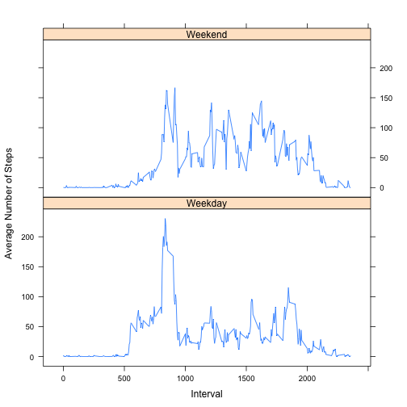

# Reproducible Research: Peer Assessment 1


## Loading and preprocessing the data

**1. Load the data**  

```r
setwd("~/Documents/coursera/reproducible_research/assignment1/RepData_PeerAssessment1")
unzip("activity.zip")
activity <- read.csv("activity.csv", header = TRUE)
```


**2. Process/transform the data (if necessary) into a format suitable for your analysis**  
- Set the "date" column to be of date type.  
- Generate a weekday column. 

```r
activity$date <- as.Date(activity$date, format = "%Y-%m-%d")
activity$weekday <- weekdays(activity$date)
```

## What is mean total number of steps taken per day?

For this part of the assignment, we ignore the missing values in
the dataset.

**1. Make a histogram of the total number of steps taken each day**

```r
totalstepsbyday <- aggregate(activity$steps, by = list(activity$date), sum)
hist(totalstepsbyday$x, 10, main = "Histogram of Total Steps Taken Each Day", 
    xlab = "Total Steps Taken Each Day")
```

 

**2. Calculate and report the **mean** and **median** total number of steps taken per day**


```r
meanstepsperday <- mean(totalstepsbyday$x, na.rm = TRUE)
print(paste("The mean steps per day is:", round(meanstepsperday, digit = 2)))
```

```
## [1] "The mean steps per day is: 10766.19"
```

```r
medianstepsperday <- median(totalstepsbyday$x, na.rm = TRUE)
print(paste("The median steps per day is:", round(medianstepsperday, digit = 2)))
```

```
## [1] "The median steps per day is: 10765"
```


## What is the average daily activity pattern?

**1. Make a time series plot (i.e. `type = "l"`) of the 5-minute interval (x-axis) and the average number of steps taken, averaged across all days (y-axis).**

```r
meanstepsbyinterval <- aggregate(activity$steps, by = list(activity$interval), 
    mean, na.rm = TRUE)
with(meanstepsbyinterval, plot(Group.1, x, type = "l"))
```

 


**2. Which 5-minute interval, on average across all the days in the dataset, contains the maximum number of steps?**

```r
maxinterval <- meanstepsbyinterval$Group.1[which.max(meanstepsbyinterval$x)]
print(paste("The 5-minute interval which contains the maximum number of steps on average across all the days in the dataset is:", 
    maxinterval))
```

```
## [1] "The 5-minute interval which contains the maximum number of steps on average across all the days in the dataset is: 835"
```

## Imputing missing values

Note that there are a number of days/intervals where there are missing
values (coded as `NA`). The presence of missing days may introduce
bias into some calculations or summaries of the data.

**1. Calculate and report the total number of missing values in the dataset.**

```r
numofmissing <- sum(is.na(activity))
print(paste("The total number of rows with `NA`s is:", numofmissing))
```

```
## [1] "The total number of rows with `NA`s is: 2304"
```

**2. Use the mean for each 5-minute interval to impute the missing values in steps.  
3. Create a new dataset that is equal to the original dataset but with the missing data filled in.**

```r
activityimputed <- activity
interval <- unique(activity$interval)
for (i in seq_along(interval)) {
    mean <- mean(activity[activity$interval == interval[i], "steps"], na.rm = TRUE)
    activityimputed[activityimputed$interval == interval[i] & is.na(activityimputed$steps), 
        "steps"] <- mean
}
```

**4. Make a histogram of the total number of steps taken each day and Calculate and report the mean and median total number of steps taken per day. Do these values differ from the estimates from the first part of the assignment? What is the impact of imputing missing data on the estimates of the total daily number of steps?**


```r
totalstepsbyday <- aggregate(activityimputed$steps, by = list(activityimputed$date), 
    sum)
hist(totalstepsbyday$x, 10, main = "Histogram of Total Steps Taken Each Day", 
    xlab = "Total Steps Taken Each Day")
```

 

```r
meanstepsperday <- mean(totalstepsbyday$x, na.rm = TRUE)
print(paste("The mean steps per day is:", round(meanstepsperday, digit = 2)))
```

```
## [1] "The mean steps per day is: 10766.19"
```

```r
medianstepsperday <- median(totalstepsbyday$x, na.rm = TRUE)
print(paste("The median steps per day is:", round(medianstepsperday, digit = 2)))
```

```
## [1] "The median steps per day is: 10766.19"
```


**The imputation does not affect the mean steps per day, since we used the group mean.
The imputation do changed the median slightly.**


## Are there differences in activity patterns between weekdays and weekends?

We use the dataset with the filled-in missing values for this part.

**1. Create a new factor variable in the dataset with two levels -- "weekday" and "weekend" indicating whether a given date is a weekday or weekend day.**

```r
activityimputed$weekend[activityimputed$weekday %in% c("Saturday", "Sunday")] <- "Weekend"
activityimputed$weekend[is.na(activityimputed$weekend)] <- "Weekday"
```

**2. Make a panel plot containing a time series plot (i.e. `type = "l"`) of the 5-minute interval (x-axis) and the average number of steps taken, averaged across all weekday days or weekend days (y-axis). The plot should look something like the following, which was creating using **simulated data**:

 


**Your plot will look different from the one above** because you will
be using the activity monitor data. Note that the above plot was made
using the lattice system but you can make the same version of the plot
using any plotting system you choose.

```r
panelplotdata <- aggregate(activityimputed$steps, by = list(activityimputed$interval, 
    activityimputed$weekend), mean)
library("lattice")
with(panelplotdata, xyplot(x ~ Group.1 | Group.2, type = "l", xlab = "Interval", 
    ylab = "Average Number of Steps", layout = c(1, 2)))
```

 


